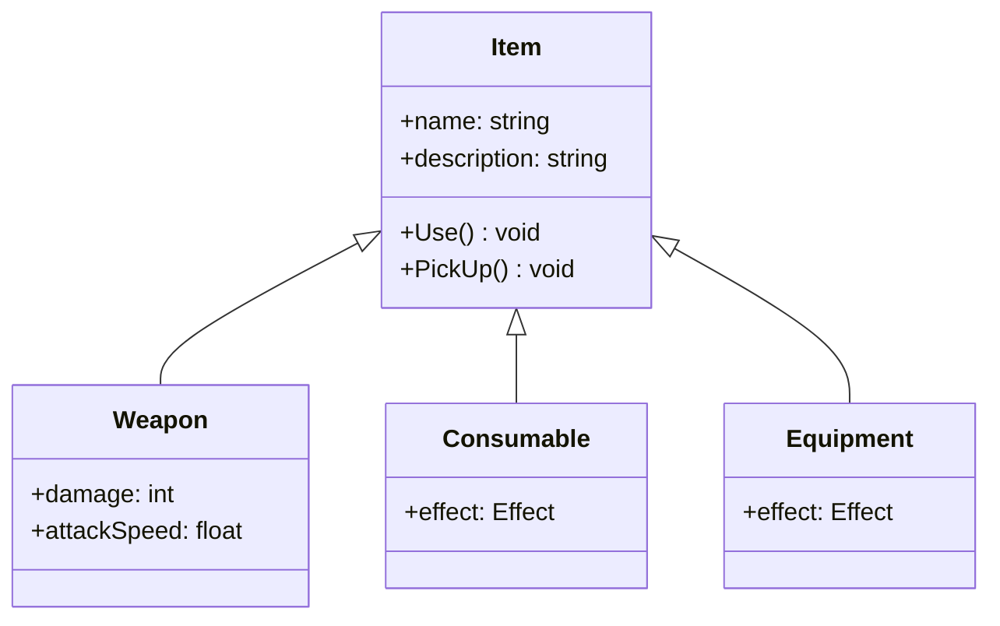

```mermaid
---
config:
  class:
    hideEmptyMembersBox: true
---
classDiagram
direction TB
    class Item {
	    +name: string
	    +description: string
	    +Use() void
	    +PickUp() void
    }
    class Consumable {
        +effect: Effect
    }
    class Equipment {
        +effect: Effect
    }
    class Weapon {
	    +damage: int
	    +attackSpeed: float
    }

    Item <|-- Weapon
    Item <|-- Consumable
    Item <|-- Equipment

```